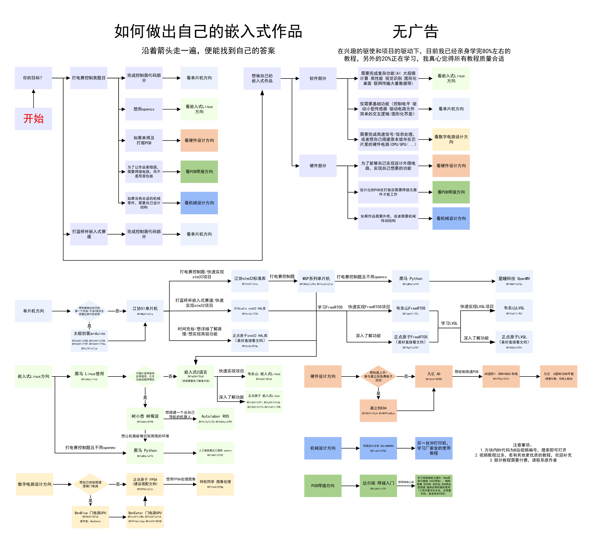

# 如何做出自己的嵌入式作品
沿着箭头走一遍，便能找到自己的答案   

# 说明
1.此项目无任何广告，在兴趣的驱使和项目的驱动下，目前我已经亲身学完80%左右的教程，另外的20%正在学习，我真心觉得所有教程质量合适 
2.方块内BV代码为B站视频编号，搜索即可打开 
3.视频教程过多，若有其他更优质的教程，欢迎补充 
4.部分教程需要付费，请联系原作者 
5.仓库里有我在学习过程中做的其他笔记，可以直接查看，后续会持续更新 
6.若需要转载分享仓库内容，请注明原作者 **B站:超级像素电子**，禁止用于商业用途 
7.本笔记仅限学习交流，原文版权归原作者所有，来源已在笔记文档内说明，笔记基于个人理解绘制，可能与原教程存在差异，建议配合原教程学习 

# 电子类竞赛：在“标准答案”之外的思考---关于比赛的现状反思
2026年3月，我整理大学以来参加比赛的工程代码，有感而发，写下了这段文字。 
参加许多电子类比赛的时候，我发现这些比赛往往都有一个标准答案，给你一段规定长度的时间，只要你能够完成题目要求，你就能拿奖。许多同学，他们为了能够快速的拿到奖项，用的比较好的传感器，甚至是黑盒模块(比如说树莓派、openmv、封装好的PID库等)，很少会有人去关心那些集成硬件模块和那些封装好的库函数的底层工作原理是什么。而且，由于是限定了时间且有标准答案，因此项目的难度往往不是很大。为了拿更高的奖项，大家比拼的是调用模块的速度和运气，而非真正的电子工程理论。 
我之前也是这样，结果自己做项目的时候，随着项目越来越复杂，由于不了解底层，导致我写出了引发底层问题的bug，黑盒破了，抽象泄露了。 
然而很多同学都没意识到这点，我和同学比完蓝桥杯比赛后，我同学说：“我学会了HAL库，收获很多”。可是蓝桥杯比赛只需要要求你熟悉HAL库的使用，而不需要理解其底层原理。如果你只会HAL库，到时候一旦API变了，或者由于代码复杂了引发了奇怪的bug，只会API的使用是无法解决的。很多人的“学会”其实只是“学会了查手册填参数”或者是背下了一堆API接口，这种知识是极其脆弱的。 
因此我认为，除了参加比赛之外，还是需要自己做一些项目，循序渐进，从简单到复杂，同时了解一些底层的东西，这样才能真正学到东西。竞赛是绝佳的练兵场，但它不应是技术视野的围墙。​ 真正的工程能力，诞生于对“标准答案”之外广阔天地的探索之中。